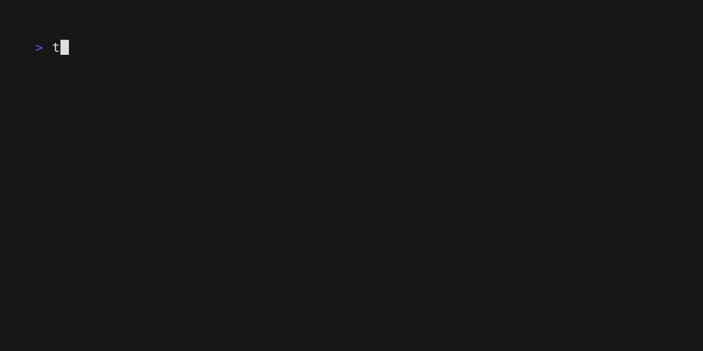

# Timer CLI

A simple command line timer application written in Rust.



## Help

```bash
timer --help
```

```
A simple CLI timer application using crossterm and tokio

Usage: timer <[[[d:]h:]m:]s duration>

Arguments:
  <[[[d:]h:]m:]s duration>  Duration in the format "[[[d:]h:]m:]s" (e.g., "1:2:3:4" for 1 day, 2 hours, 3 minutes, and 4 seconds)

Options:
  -h, --help     Print help
  -V, --version  Print version
```

## Installation

### From releases page

You can download the [latest release](https://github.com/DanikVitek/timer-cli/releases/latest) from the [releases page](https://github.com/DanikVitek/timer-cli/releases)
and extract the binary for your platform. After downloading, make sure to include the binary in your system's PATH.

### Using Cargo

You can install the Timer CLI using Cargo, Rust's package manager. Run the following command:

```bash
cargo install --git https://github.com/DanikVitek/timer-cli.git --locked
```
